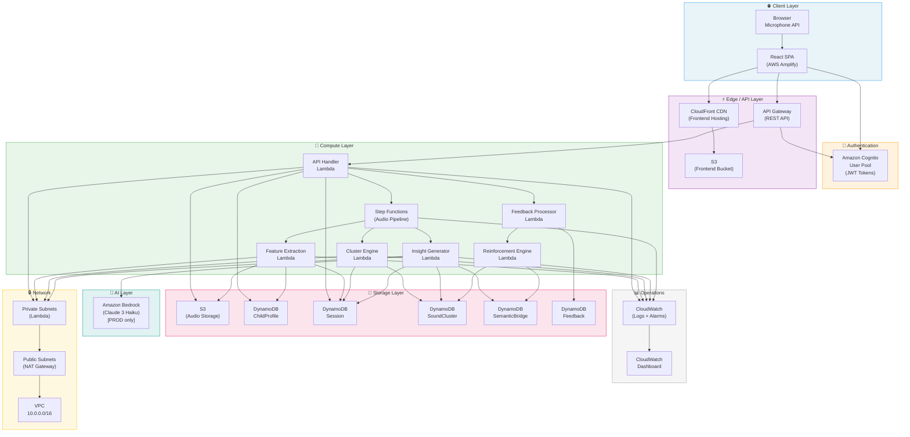
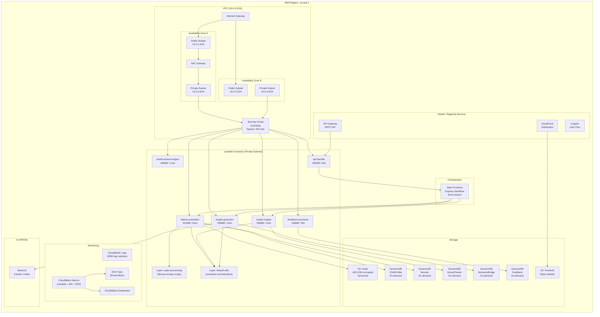
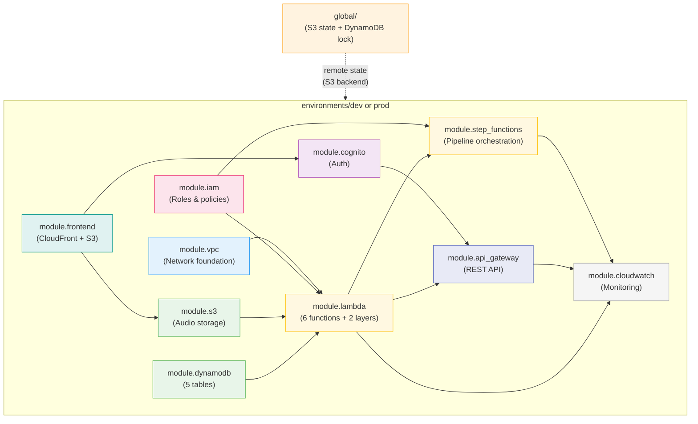
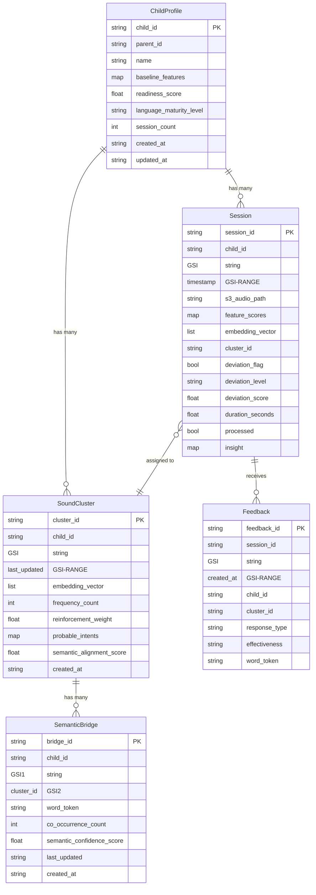
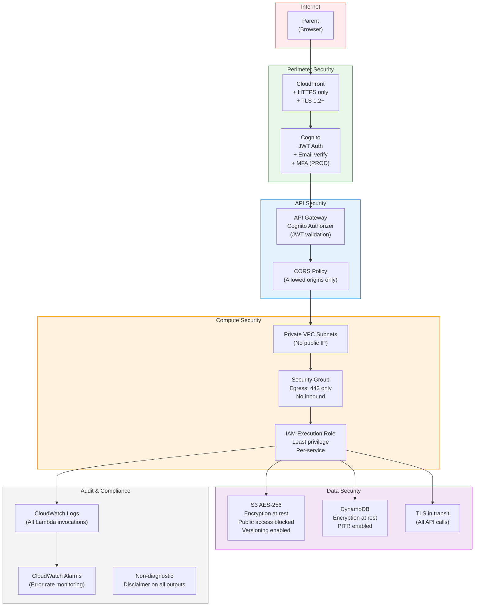
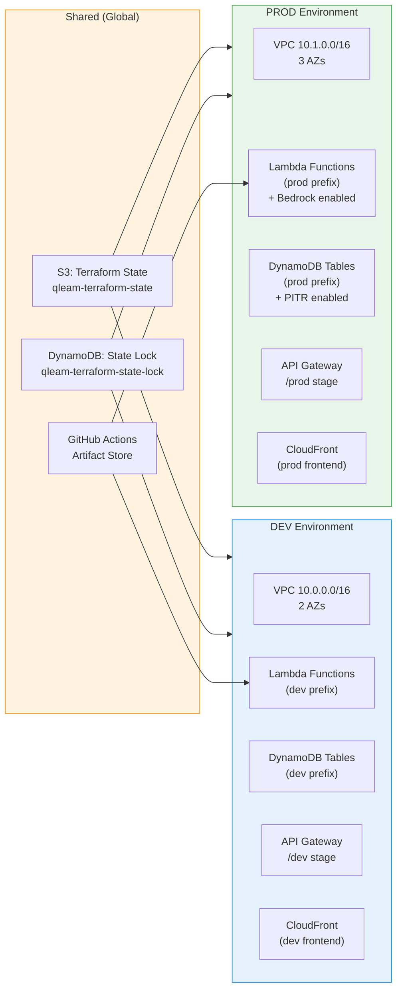
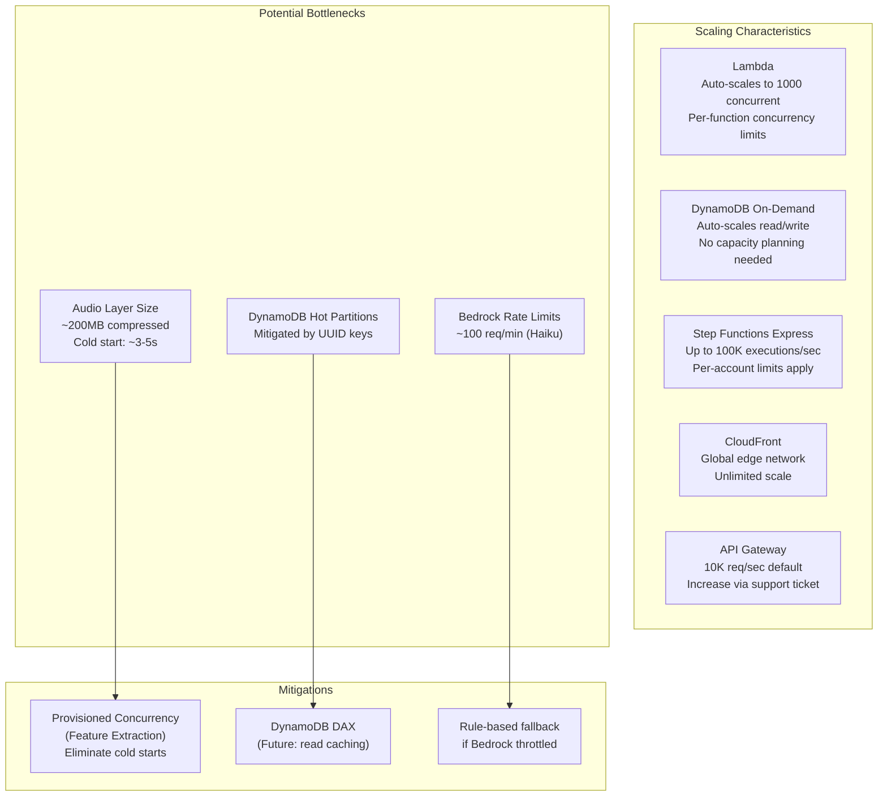

# Qleam MVP — Architecture Document

> Complete system architecture with diagrams for all layers: infrastructure, data flow, ML pipeline, and security.

---

## 1. High-Level System Architecture

---

## 2. AWS Infrastructure Architecture

---

## 3. Terraform Module Dependency Graph

---

## 4. DynamoDB Data Model

---

## 5. Security Architecture

---

## 6. Multi-Environment Architecture

---

## 7. Component Interaction Summary

| Component | Triggers | Triggered By | Data Written | Data Read |
|-----------|----------|--------------|--------------|-----------|
| API Handler | User HTTP request | API Gateway | Session (pending) | ChildProfile, Session |
| Feature Extraction | Step Function | Step Functions | Session, ChildProfile | S3 audio |
| Cluster Engine | Step Function | Step Functions | SoundCluster, Session | SoundCluster |
| Insight Generator | Step Function | Step Functions | Session (insight) | Session, SoundCluster, SemanticBridge, ChildProfile |
| Feedback Processor | API Handler | API Handler (sync) | Feedback | Session |
| Reinforcement Engine | Feedback Processor | Feedback Processor (async) | SoundCluster, SemanticBridge | SoundCluster |

---

## 8. Scalability Design

---

*Architecture version: MVP 1.0 — February 2026*
