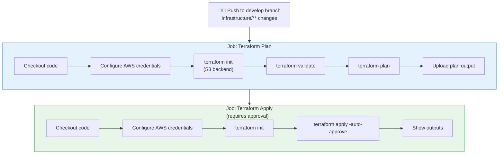
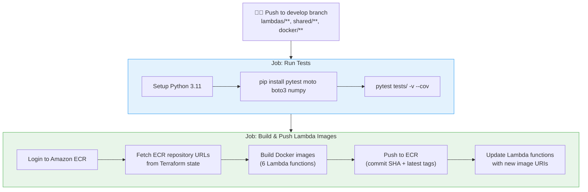
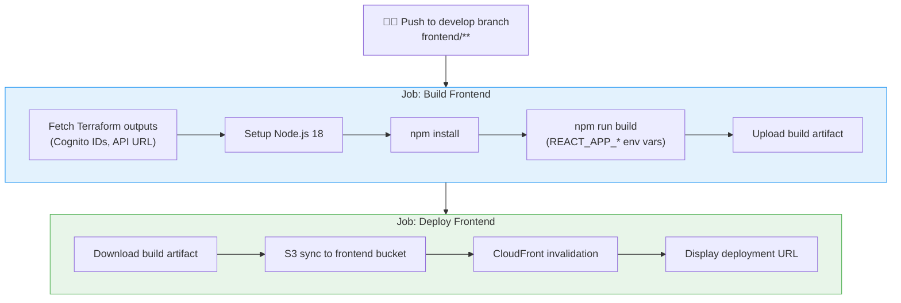
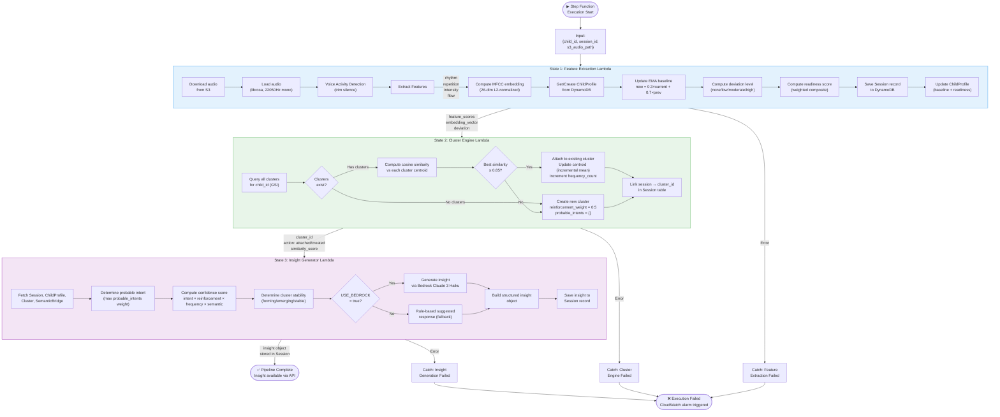
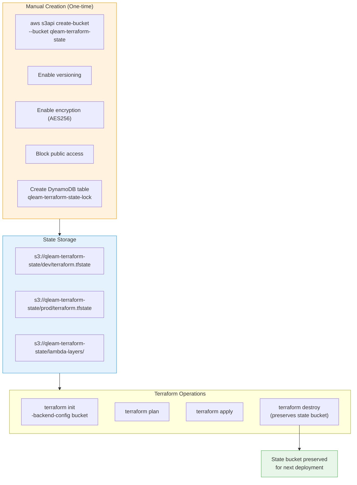
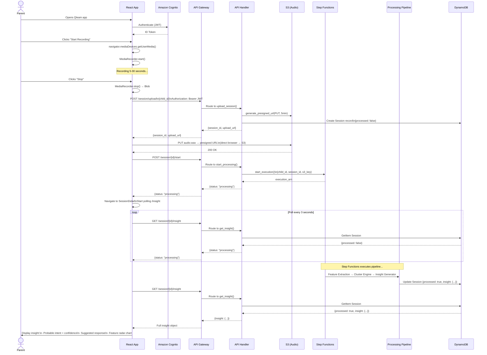

# Qleam MVP — Workflow Diagrams

> End-to-end workflow diagrams for every major process in the Qleam system.

---

## 1. CI/CD Pipeline Workflow (3 Separate Workflows)

Qleam uses **3 independent workflows** to allow isolated deployments:

### 1.1 Infrastructure Workflow (`infra-deploy.yml`)
Triggers on changes to `infrastructure/**` (except Lambda module)

### 1.2 Lambda Workflow (`lambda-deploy.yml`)
Triggers on changes to `lambdas/**`, `shared/**`, or `docker/**`

### 1.3 Frontend Workflow (`frontend-deploy.yml`)
Triggers on changes to `frontend/**`

---

## 2. Lambda Container Image Architecture

Lambda functions are deployed as **Docker container images** stored in ECR:

```mermaid
flowchart LR
    subgraph SOURCE["Source Code"]
        HANDLER["handler.py\n(Lambda code)"]
        SHARED["shared/\n(common utilities)"]
        DOCKER["Dockerfile\n(AWS Lambda Python 3.11)"]
    end
    
    subgraph BUILD["Build Process"]
        DOCKER_BUILD["docker build\n-t ecr-repo:sha"]
        LIBROSA["librosa, scipy, numpy\n(audio processing)"]
        BOTO3["boto3\n(AWS SDK)"]
    end
    
    subgraph ECR["Amazon ECR"]
        REPO_FE["qleam-dev-feature-extraction"]
        REPO_CE["qleam-dev-cluster-engine"]
        REPO_RE["qleam-dev-reinforcement-engine"]
        REPO_IG["qleam-dev-insight-generator"]
        REPO_FP["qleam-dev-feedback-processor"]
        REPO_AH["qleam-dev-api-handler"]
    end
    
    subgraph LAMBDA["AWS Lambda"]
        L_FE["Feature Extraction\n(1024 MB)"]
        L_CE["Cluster Engine\n(512 MB)"]
        L_RE["Reinforcement Engine\n(512 MB)"]
        L_IG["Insight Generator\n(512 MB)"]
        L_FP["Feedback Processor\n(512 MB)"]
        L_AH["API Handler\n(512 MB)"]
    end
    
    SOURCE --> BUILD
    BUILD --> ECR
    ECR --> LAMBDA
    
    style ECR fill:#fff3e0,stroke:#FF9800
    style LAMBDA fill:#e8f5e9,stroke:#4CAF50
```

---

## 3. Audio Processing Pipeline (Step Functions)

---

## 4. Bootstrap & First-Time Setup Workflow

```mermaid
flowchart TD
    START(["🚀 Start: New Project Setup"])

    START --> PREREQ["Install Prerequisites\nAWS CLI, Terraform, Docker, Python, Node, Git"]
    PREREQ --> IAM_SETUP["Create IAM User: qleam-cicd\nAttach AdministratorAccess\nGenerate Access Keys"]
    IAM_SETUP --> GITHUB_REPO["Create GitHub Repository\nPush qleam/ code"]
    GITHUB_REPO --> SECRETS["Add GitHub Secrets:\n• AWS_ACCESS_KEY_ID\n• AWS_SECRET_ACCESS_KEY"]

    SECRETS --> MANUAL_STATE["📦 Manually Create State Bucket\naws s3api create-bucket\n--bucket qleam-terraform-state"]
    
    MANUAL_STATE --> STATE_CONFIG["Configure State Bucket:\n• Enable versioning\n• Enable encryption\n• Block public access\n• Create DynamoDB lock table"]

    STATE_CONFIG --> ENV_SETUP["Create GitHub Environments:\n• dev (no protection)\n• prod (required reviewers)"]

    ENV_SETUP --> BEDROCK_CHECK{"Using Bedrock\nin PROD?"}
    BEDROCK_CHECK -->|Yes| BEDROCK_ENABLE["Enable Bedrock Model Access\nAWS Console → Bedrock\n→ Claude 3 Haiku"]
    BEDROCK_CHECK -->|No| PUSH_DEV

    BEDROCK_ENABLE --> PUSH_DEV["git push origin develop\n→ Triggers infra-deploy"]

    PUSH_DEV --> INFRA_DEPLOY["Infrastructure Deployed:\n• VPC, IAM, ECR\n• S3, DynamoDB\n• Cognito, API Gateway\n• Step Functions, CloudWatch"]

    INFRA_DEPLOY --> LAMBDA_DEPLOY["Trigger lambda-deploy:\n• Build Docker images\n• Push to ECR\n• Update Lambda functions"]

    LAMBDA_DEPLOY --> TEST_DEV["Test DEV Environment:\n• Sign up via CloudFront URL\n• Record test audio\n• Verify insight generated"]

    TEST_DEV --> PROD_READY{"Ready for PROD?"}
    PROD_READY -->|Yes| PUSH_MAIN["git push origin main\n→ Triggers PROD pipeline"]
    PROD_READY -->|No| ITERATE["Iterate on DEV\nFix issues"]
    ITERATE --> PUSH_DEV

    PUSH_MAIN --> APPROVAL["⏸️ Manual Approval\nRequired in GitHub"]
    APPROVAL --> PROD_DEPLOY["PROD Deployed ✅\nAll resources created"]
    PROD_DEPLOY --> DONE(["🎉 Qleam MVP Live!"])

    style START fill:#e8f5e9,stroke:#4CAF50
    style DONE fill:#e8f5e9,stroke:#4CAF50
    style MANUAL_STATE fill:#fff3e0,stroke:#FF9800
    style APPROVAL fill:#fce4ec,stroke:#E91E63
```

---

## 5. Terraform State Management

The Terraform state is stored in a **manually created S3 bucket** that persists across destroy/deploy cycles:

---

## 6. Parent Session Recording Workflow

---

*Workflow diagrams version: MVP 2.0 — February 2026*
*All diagrams use Mermaid syntax — render in GitHub, VS Code (Mermaid extension), or https://mermaid.live*