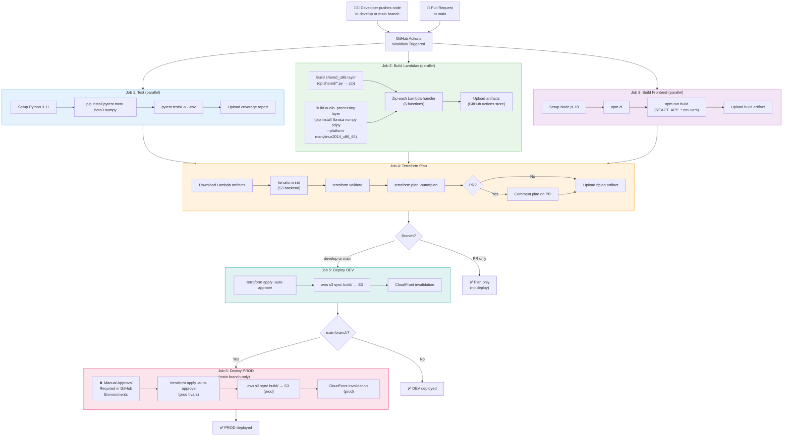
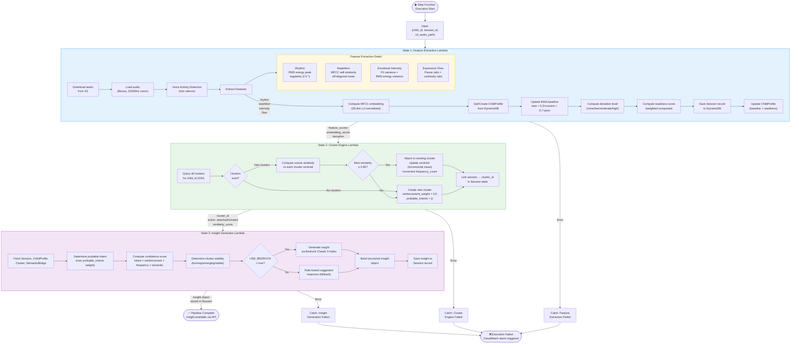
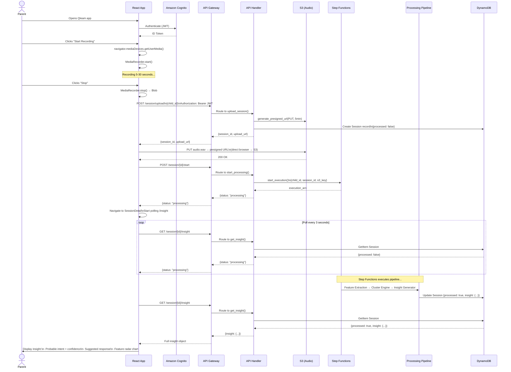
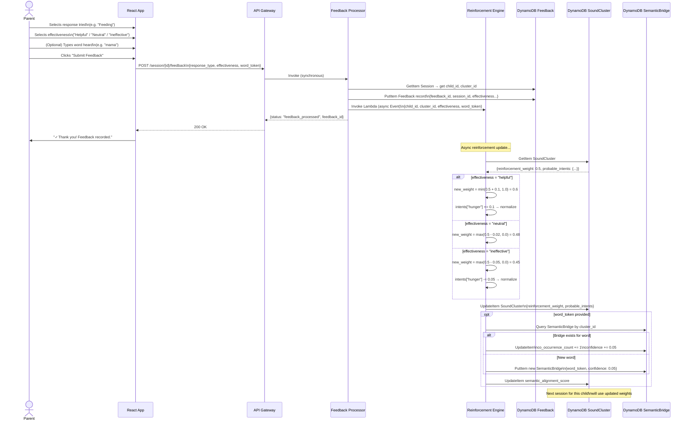
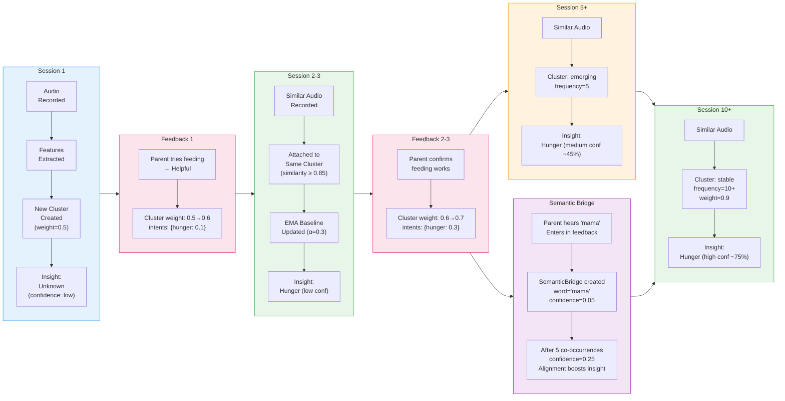
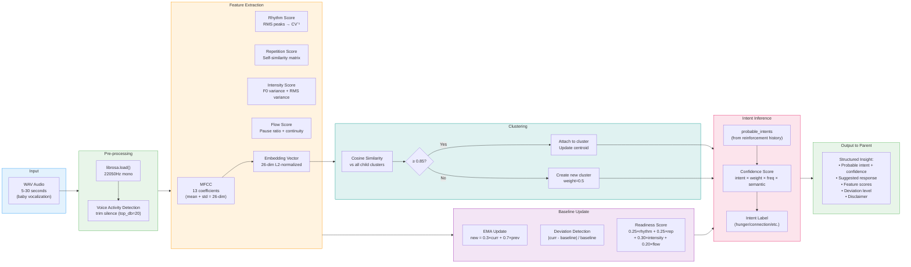

# Qleam MVP — Workflow Diagrams

> End-to-end workflow diagrams for every major process in the Qleam system.

---

## 1. CI/CD Pipeline Workflow

---

## 2. Audio Processing Pipeline (Step Functions)

---

## 3. Parent Session Recording Workflow

---

## 4. Feedback & Reinforcement Learning Workflow

---

## 5. ML Learning Loop Over Time

---

## 6. Bootstrap & First-Time Setup Workflow

```mermaid
flowchart TD
    START(["🚀 Start: New Project Setup"])

    START --> PREREQ["Install Prerequisites\nAWS CLI, Terraform, Python, Node, Git"]
    PREREQ --> IAM_SETUP["Create IAM User: qleam-cicd\nAttach AdministratorAccess\nGenerate Access Keys"]
    IAM_SETUP --> GITHUB_REPO["Create GitHub Repository\nPush qleam/ code"]
    GITHUB_REPO --> SECRETS1["Add GitHub Secrets:\n• AWS_ACCESS_KEY_ID\n• AWS_SECRET_ACCESS_KEY"]

    SECRETS1 --> BOOTSTRAP["Run Bootstrap Workflow\n(GitHub Actions)\nType 'bootstrap' to confirm"]

    BOOTSTRAP --> BOOTSTRAP_CREATES["Creates:\n• S3: qleam-terraform-state-XXXX\n• DynamoDB: qleam-terraform-state-lock"]

    BOOTSTRAP_CREATES --> SECRETS2["Add GitHub Secrets:\n• TF_STATE_BUCKET\n• TF_STATE_LOCK_TABLE"]

    SECRETS2 --> ENV_SETUP["Create GitHub Environments:\n• dev (no protection)\n• prod (required reviewers)"]

    ENV_SETUP --> BEDROCK_CHECK{"Using Bedrock\nin PROD?"}
    BEDROCK_CHECK -->|Yes| BEDROCK_ENABLE["Enable Bedrock Model Access\nAWS Console → Bedrock\n→ Claude 3 Haiku"]
    BEDROCK_CHECK -->|No| PUSH_DEV

    BEDROCK_ENABLE --> PUSH_DEV["git push origin develop\n→ Triggers CI/CD"]

    PUSH_DEV --> PIPELINE_RUNS["Pipeline Runs:\n1. Tests ✅\n2. Build Lambdas ✅\n3. Build Frontend ✅\n4. TF Plan ✅\n5. TF Apply DEV ✅\n6. Deploy Frontend ✅"]

    PIPELINE_RUNS --> GET_OUTPUTS["Get Terraform Outputs:\nterraform output\n(API URL, Cognito IDs, CloudFront)"]

    GET_OUTPUTS --> FRONTEND_CONFIG["Add Frontend Secrets:\n• REACT_APP_COGNITO_USER_POOL_ID\n• REACT_APP_COGNITO_CLIENT_ID\n• REACT_APP_API_URL"]

    FRONTEND_CONFIG --> TEST_DEV["Test DEV Environment:\n• Sign up via CloudFront URL\n• Record test audio\n• Verify insight generated"]

    TEST_DEV --> PROD_READY{"Ready for PROD?"}
    PROD_READY -->|Yes| PUSH_MAIN["git push origin main\n→ Triggers PROD pipeline"]
    PROD_READY -->|No| ITERATE["Iterate on DEV\nFix issues"]
    ITERATE --> PUSH_DEV

    PUSH_MAIN --> APPROVAL["⏸️ Manual Approval\nRequired in GitHub"]
    APPROVAL --> PROD_DEPLOY["PROD Deployed ✅\nAll resources created"]
    PROD_DEPLOY --> DONE(["🎉 Qleam MVP Live!"])

    style START fill:#e8f5e9,stroke:#4CAF50
    style DONE fill:#e8f5e9,stroke:#4CAF50
    style BOOTSTRAP fill:#fff3e0,stroke:#FF9800
    style APPROVAL fill:#fce4ec,stroke:#E91E63
```

---

## 7. Data Flow: Audio → Insight

---

*Workflow diagrams version: MVP 1.0 — February 2026*
*All diagrams use Mermaid syntax — render in GitHub, VS Code (Mermaid extension), or https://mermaid.live*
